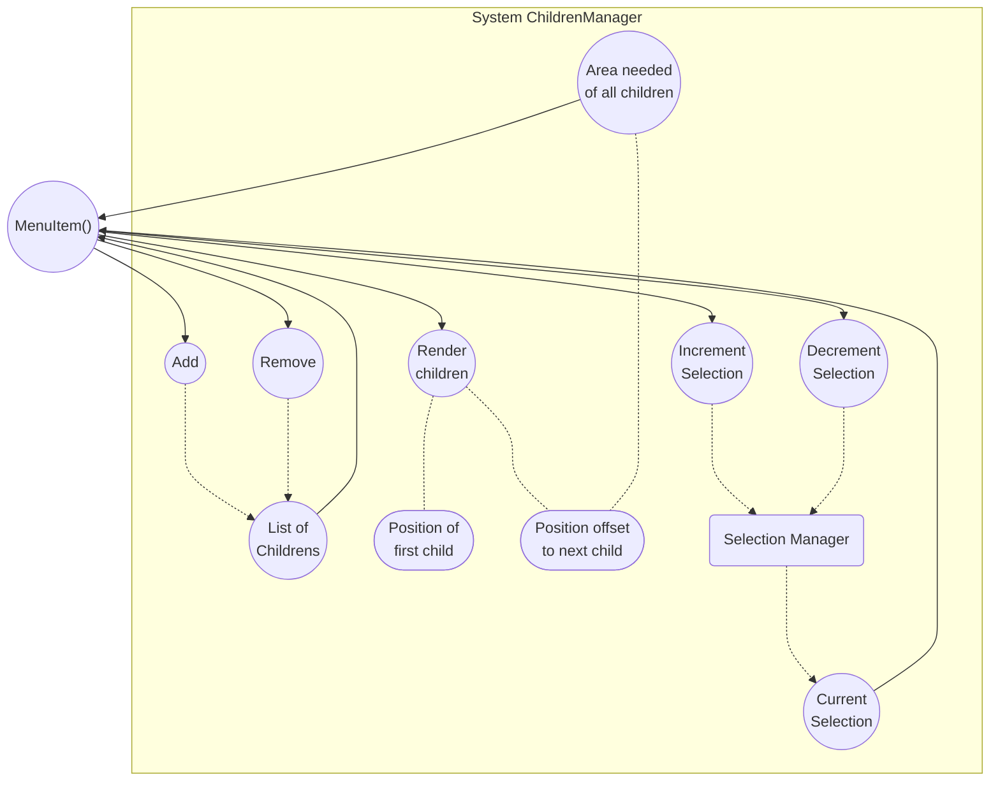

# ChildrenManager

```mermaid
flowchart
    MenuItem(("MenuItem()"))

    subgraph System["System ChildrenManager"]
        Add(("Add"))
        Remove(("Remove"))
        Childrens(("List of\nChildrens"))
        Render(("Render\nchildren"))
        AreaNeeded(("Area needed\nof all children"))

        IncrementSelection(("Increment\nSelection"))
        DecrementSelection(("Decrement\nSelection"))
        CurrentSelection(("Current\nSelection"))

        Position(["Position of\nfirst child"])
        PositionOffset(["Position offset\nto next child"])

        SelectionManager("Selection Manager")
    end

    MenuItem --> Add & Remove & Render & IncrementSelection & DecrementSelection
    Childrens & AreaNeeded & CurrentSelection --> MenuItem
    Add & Remove -..-> Childrens
    Render -..- Position & PositionOffset
    AreaNeeded -..- PositionOffset
    IncrementSelection & DecrementSelection -..-> SelectionManager -..-> CurrentSelection
    
    
```