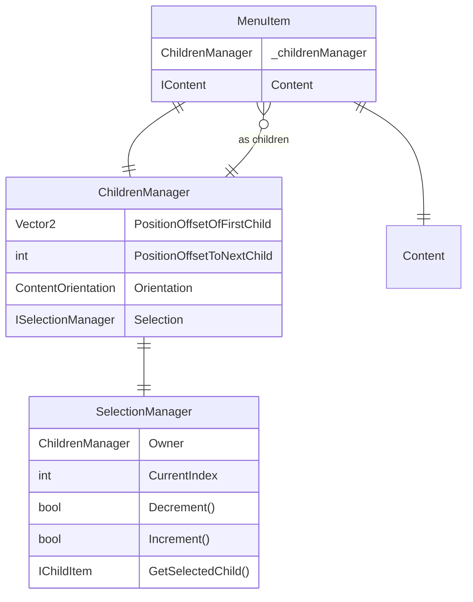

# Entity Relationship diagram for ConsoleMenu

```mermaid
erDiagram
    MenuItem {
        ChildrenManager _childrenManager
        IContent Content

    }
    ChildrenManager {
        Vector2 PositionOffsetOfFirstChild
        int PositionOffsetToNextChild
        ContentOrientation Orientation
        ISelectionManager Selection
    }

    SelectionManager {
        ChildrenManager Owner 
        int CurrentIndex
        bool Decrement()
        bool Increment()
        IChildItem GetSelectedChild()
    }

    MenuItem ||--|| ChildrenManager : ""
    MenuItem ||--|| Content : ""
    ChildrenManager ||--o{ MenuItem : "as children"
    ChildrenManager ||--|| SelectionManager : ""
```