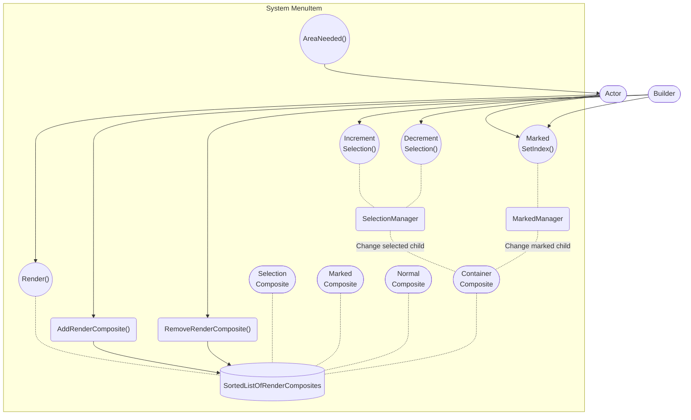
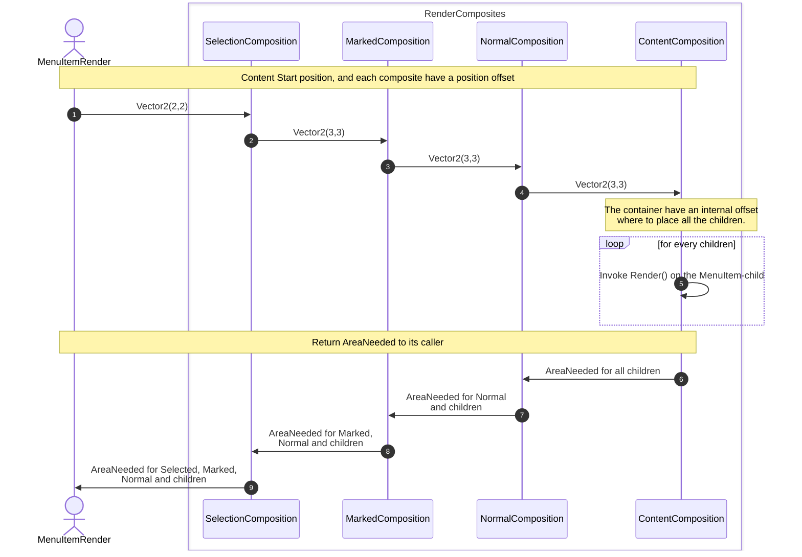

# MenuItem

```mermaid
flowchart TD
    actor(["Actor"])
    builder(["Builder"])

    subgraph System["System MenuItem"]
        Render(("Render()"))
        AreaNeeded(("AreaNeeded()"))

        AddRenderComposite("AddRenderComposite()")
        RemoveRenderComposite("RemoveRenderComposite()")
        SortedListOfRenderComposite[("SortedListOfRenderComposites")]

        IncrementSelection(("Increment\nSelection()"))
        DecrementSelection(("Decrement\nSelection()"))
        SelectionManager("SelectionManager")
        
        MarkedSetIndex(("Marked\nSetIndex()"))
        MarkedManager("MarkedManager")

        SelectionComposite([Selection<BR> Composite])
        MarkedComposite([Marked<BR> Composite])
        NormalComposite([Normal<BR> Composite])
        ContainerComposite([Container<BR> Composite])

    end

    actor --> Render -..- SortedListOfRenderComposite
    actor --> IncrementSelection & DecrementSelection -..- SelectionManager -.Change selected child.- ContainerComposite
    
    actor & builder --> MarkedSetIndex -..- MarkedManager -.Change marked child.- ContainerComposite
    AreaNeeded --> actor
    builder --> AddRenderComposite --> SortedListOfRenderComposite
    builder --> RemoveRenderComposite --> SortedListOfRenderComposite

    SelectionComposite & MarkedComposite & NormalComposite & ContainerComposite -..- SortedListOfRenderComposite
```

```mermaid
sequenceDiagram
    autonumber
    actor A as MenuItemRender
    box RenderComposites
        participant S as SelectionComposition
        participant M as MarkedComposition
        participant N as NormalComposition
        participant C as ContentComposition
    end

    Note over A,C: Content Start position, and each composite have a position offset
    A ->> S: Vector2(2,2)
    S ->> M: Vector2(3,3)
    M ->> N: Vector2(3,3)
    N ->> C: Vector2(3,3)
    Note over C: The container have an internal offset<BR>where to place all the children.

    loop for every children
        C ->> C: Invoke Render() on the MenuItem-child
    end
    Note over A,C: Return AreaNeeded to its caller
    C ->> N: AreaNeeded for all children
    N ->> M: AreaNeeded for Normal<BR>and children
    M ->> S: AreaNeeded for Marked,<BR>Normal and children
    S ->> A: AreaNeeded for Selected, Marked,<BR>Normal and children
```