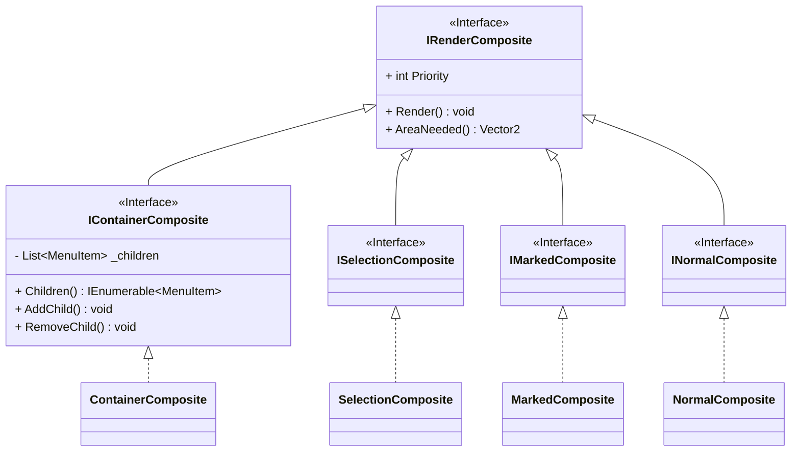

# RenderComposite

## IRenderComposite

```mermaid
classDiagram

class IRenderComposite {
    <<Interface>>
    + int Priority
    + Render() void
    + AreaNeeded() Vector2
}

class ISelectionComposite {
    <<Interface>>
}
class IMarkedComposite {
    <<Interface>>
}
class INormalComposite {
    <<Interface>>
}

class IContainerComposite{
    <<Interface>>
    - List~MenuItem~ _children
    + Children() IEnumerable~MenuItem~
    + AddChild() void
    + RemoveChild() void
}

IRenderComposite <|-- IContainerComposite
IRenderComposite <|-- ISelectionComposite
IRenderComposite <|-- IMarkedComposite
IRenderComposite <|-- INormalComposite

class SelectionComposite
class MarkedComposite
class NormalComposite
class ContainerComposite
ISelectionComposite <|.. SelectionComposite
IMarkedComposite <|.. MarkedComposite
INormalComposite <|.. NormalComposite
IContainerComposite <|.. ContainerComposite
```