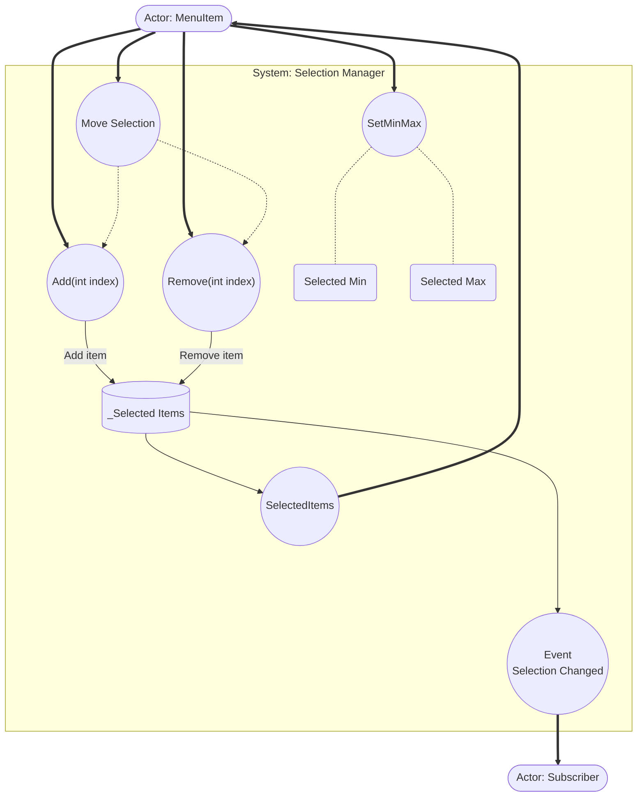
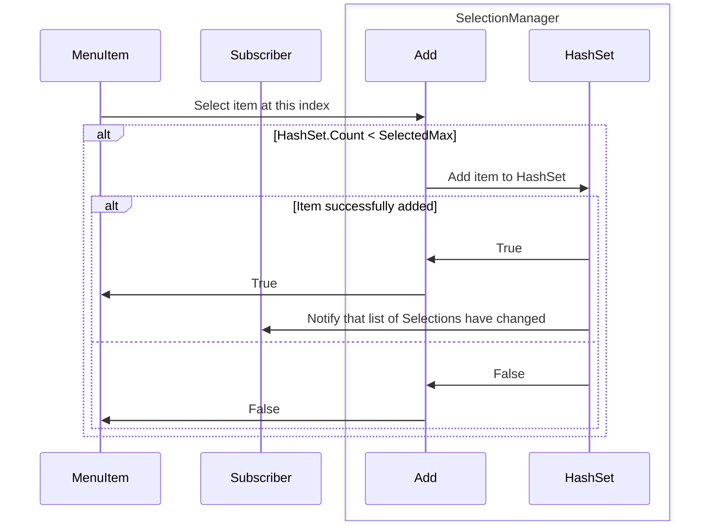
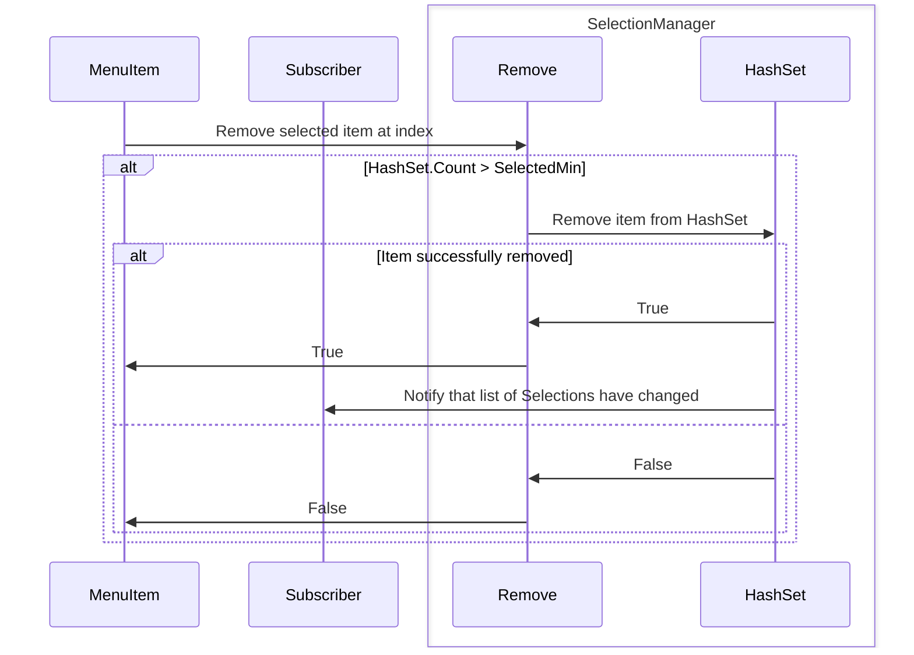
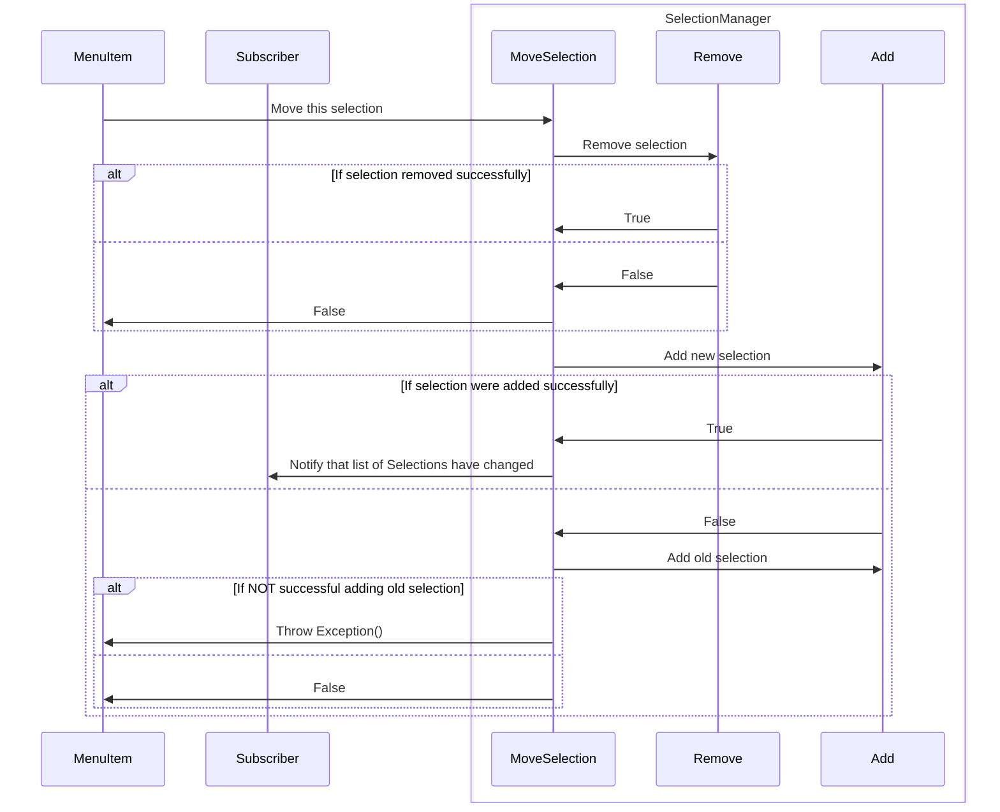

# SelectionManager

```mermaid
flowchart
    menuItem(["Actor: MenuItem"])
    subscriber(["Actor: Subscriber"])

    subgraph System["System: Selection Manager"]
        Add(("Add(int index)"))
        Remove(("Remove(int index)"))
        MoveSelection(("Move Selection"))
        Selected(("SelectedItems"))

        SetMinMax(("SetMinMax"))
        MinimumSelected("Selected Min")
        MaxSelected("Selected Max")
        EventOnSelectionChanged(("Event\nSelection Changed"))

        _SelectedItems[("_Selected Items")]
    end

    menuItem ==> Add & Remove & MoveSelection
    Selected ==> menuItem
    menuItem ==> SetMinMax -..- MinimumSelected & MaxSelected
    MoveSelection -..-> Add & Remove

    Add --Add item--> _SelectedItems
    Remove --Remove item--> _SelectedItems
    _SelectedItems --> Selected

    _SelectedItems ----> EventOnSelectionChanged ==> subscriber
```

## Add

```mermaid
sequenceDiagram
    participant M as MenuItem
    participant S as Subscriber
    box SelectionManager
        participant A as Add
        participant H as HashSet
    end

    M->>A: Select item at this index
    alt HashSet.Count < SelectedMax
        A->>H: Add item to HashSet
        alt Item successfully added
            H->>A: True
            A->>M: True
            H->>S: Notify that list of Selections have changed
        else
            H->>A: False
            A->>M: False
        end
    end
```

## Remove

```mermaid
sequenceDiagram
    participant M as MenuItem
    participant S as Subscriber
    box SelectionManager
        participant R as Remove
        participant H as HashSet
    end

    M->>R: Remove selected item at index
    alt HashSet.Count > SelectedMin
        R->>H: Remove item from HashSet
        alt Item successfully removed
            H->>R: True
            R->>M: True
            H->>S: Notify that list of Selections have changed
        else
            H->>R: False
            R->>M: False
        end
    end
```

## MoveSelection

```mermaid
sequenceDiagram
    participant M as MenuItem
    participant S as Subscriber
    box SelectionManager
        participant AR as MoveSelection
        participant R as Remove
        participant A as Add
    end

    M->>AR: Move this selection
    AR->>R: Remove selection
    alt If selection removed successfully
        R->>AR: True
    else
        R->>AR: False
        AR->>M: False
    end

    AR->>A: Add new selection
    alt If selection were added successfully
        A->>AR: True
        AR->>S: Notify that list of Selections have changed
    else
        A->>AR: False
        AR->>A: Add old selection
        alt If NOT successful adding old selection
            AR->>M: Throw Exception()
        else
            AR->>M: False
        end
    end
```