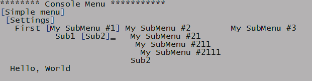

# Console Menu
**Display a menu in your Console-app.**



[](https://github.com/MikyGus/ConsoleMenu/actions/workflows/ci.yaml)

- [Console Menu](#console-menu)
	- [Create a simple menu](#create-a-simple-menu)
	- [Vector2](#vector2)
	- [MenuItem](#menuitem)
		- [Visibility](#visibility)
		- [Position](#position)
	- [Children of MenuItem](#children-of-menuitem)
		- [Access child node of MenuItem](#access-child-node-of-menuitem)
		- [Add children](#add-children)
		- [Remove children](#remove-children)
		- [Content orientation](#content-orientation)
		- [PositionOffsetOfFirstChild](#positionoffsetoffirstchild)
	- [Renderers](#renderers)
		- [SetRenderer](#setrenderer)
		- [Render](#render)
		- [ReRender](#rerender)
		- [EraseContent](#erasecontent)
	- [Components](#components)
		- [Add Components](#add-components)
		- [Remove Components](#remove-components)
		- [Get value from components](#get-value-from-components)
	- [Events](#events)
		- [KeyPressed](#keypressed)
		- [SetAction](#setaction)
		- [Events](#events-1)
			- [Example use of events](#example-use-of-events)


## Create a simple menu
Below is an example of a simple menu. This will print a simple menu with three items.
```csharp
	MenuItem menu = new MenuItem("Simple menu");
	menu.Children.Add(1, new MenuItem("Menu 1"));
	menu.Children.Add(2, new MenuItem("Menu 2"));
	menu.Children.Add(3, new MenuItem("Menu 3"));
	menu.Render();
```

**Output**
```bash
 Simple menu 
  Menu 1
  Menu 2
  Menu 3
```

## Vector2
```record struct Vector2(int X, int Y)```

Represents a point in a 2D space or 2D area with integers for X and Y.

**Properties**
```csharp
    public int X { get; set; }
    public int Y { get; set; }
```

```
**Static**
```csharp
	public static Vector2 ZERO => new(0, 0);
	public static Vector2 UP => new(0, -1);
	public static Vector2 DOWN => new(0, 1);
	public static Vector2 LEFT => new(-1, 0);
	public static Vector2 RIGHT => new(1, 0);
	public static Vector2 LEFT_UP => new(-1, -1);
	public static Vector2 LEFT_DOWN => new(-1, 1);
	public static Vector2 RIGHT_UP => new(1, -1);
	public static Vector2 RIGHT_DOWN => new(1, 1);
```
## MenuItem
### Visibility
```csharp
    bool IsVisible { get; set; } // Default: true
    bool MayCollapse { get; set; } // Default: true
```
```IsVisible``` specifies if ```Render()``` should render this item.
```MayCollapse``` specifies if other nodes should collapse in on this items area if it becomes hidden. (IsVisible == false)

### Position
```(Vector2) MenuItem.Position```

The first menuItem is by default placed at the coordinates 0,0. With the ```Vector2``` class. To change position use the ```Position``` property on menuItem. 

	**WARNING!!**
	The positions of the menuItems children will be overwritten! 
	You can therefore not change the position of the children.

```csharp
	MenuItem menu = new MenuItem("Simple menu");
->> menu.Position = new Vector2(0,1);
	menu.Children.Add(1, new MenuItem("Menu 1"));
	menu.Children.Add(2, new MenuItem("Menu 2"));
	menu.Children.Add(3, new MenuItem("Menu 3"));
	menu.Render();
```
## Children of MenuItem
### Access child node of MenuItem
After we have added a child-node to our MenuItem we can access it with a index.

```MenuItem[int index]``` returns a ```IMenuItem``` at index counting from the top 
```MenuItem[string title]``` returns a ```IMenuItem```, the first (if more than one) with the title equal to 'title'

```csharp
	IMenuItem menuSettings = new MenuItem("Settings");
	menuSettings.AddChild("Sub 1");
	menuSettings["Sub 1"].Content.Title = "New Sub 1";
	menuSettings["New Sub 1"].AddChild("Sub Sub 1");
	menuSettings[0][0].Content.Title = "New Sub Sub 1";
```

### Add children
To add children to a menuItem we use the ```MenuItem.AddChild()``` method

```(void) MenuItem.AddChild(string MenuItemTitle) ```
The method takes one (1) string argument, used as the title of the menuItem.
```(void) MenuItem.AddChild<T>(string MenuItemTitle, T value)```
The method takes two (2) arguments. The first is the title of the menuITem. The second 
is the value to be added to this menu. The value is added as a ```ValueComponent```, se components.

```csharp
	IMenuItem menuSettings = new MenuItem("Settings");
	menuSettings.AddChild("Sub 1");
	menuSettings["Sub 1"].AddChild("Sub Sub 1");
	menuSettings[0].AddChild("Sub Sub 2");
	menuSettings.AddChild("Sub 2");
	menuSettings.AddChild<int>(title: "My SubMenu with a value", value: 42);
	menuSettings.AddChild("Another subMenu with a value", 33);
```

**Output**
```bash
 Settings 
  Sub 1
   Sub Sub 1
   Sub Sub 2
  Sub 2
  My SubMenu with a value
  Another subMenu with a value
```

### Remove children
If you need to remove child from a menuItems children you use the ```MenuItem.RemoveChild()``` method.

- ```(void) MenuItem.Remove(IMenuItem)``` 
  Takes one (1) argument, ```IMenuItem```. It removes the first item that matches provided argument. 
  If item is not found an ```ArgumentException``` is thrown.
- ```(void) MenuItem.Remove(int)```
  Takes one (1) argument, ```int```. Removes menuItem at provided index.
  If item is not found an ```ArgumentOutOfRangeException``` is thrown.
  

```csharp
	IMenuItem menuSettings = new MenuItem("Settings");
	menuSettings.AddChild("Sub 1");
	menuSettings["Sub 1"].AddChild("Sub Sub 1");
	menuSettings[0].AddChild("Sub Sub 2");
	menuSettings.AddChild("Sub 2");

->>	menuSettings.RemoveChild(1); // with index
->>	menuSettings.RemoveChild(menuSettings[0]); // by reference
```

### Content orientation
As default the children to a menuItem have a vertical orientation. To print in a horizontal orientation we add a ContentOrientation.

```csharp
	IMenuItem menu = new MenuItem("Simple menu");
	menu.AddChild("My SubMenu #1");
	menu[0].AddChild("Sub1");
	menu[0].AddChild("Sub2");
	string subMenu2Title = "My SubMenu #2";
	menu.AddChild(subMenu2Title);
	menu[subMenu2Title].AddChild("Sub1");
	menu[subMenu2Title].AddChild("Sub2");
	menu.AddChild("My SubMenu #3");
	// This will only orient the children of 'menu', not their children.
->>	menu.OrientationOfChildren = Orientation.Horizontal;
	menu.Render();
```

The options for Orientation are ```Vertical``` (default) and ```Horizontal```
```csharp
menu.OrientationOfChildren = Orientation.Horizontal;
menu.OrientationOfChildren = Orientation.Vertical;
```

**Output - Vertical**
```bash
 Simple menu 
  My SubMenu #1
   Sub1
   Sub2
  My SubMenu #2
   Sub1
   Sub2
  My SubMenu #3
```

**Output - Horizontal**
```bash
 Simple menu 
  My SubMenu #1  My SubMenu #2  My SubMenu #3
   Sub1           Sub1
   Sub2           Sub2
```


### PositionOffsetOfFirstChild
```Vector2 IChildrenManager.PositionOffsetOfFirstChild { get; set; }```

Offsets the first child and the rest follows. If set to Vector2(0,0), the first child is positioned directly below the parent menuItem.
```csharp
	MenuItem menu = new MenuItem("Simple menu");
	menu.Position = new Vector2(0, 1);
	menu.Children.Add(1, new MenuItem("Menu 1"));
	menu.Children.Add(2, new MenuItem("Menu 2"));
	menu.Children.Add(3, new MenuItem("Menu 3"));
	menu.Children.Orientation = Library.Managers.ContentOrientation.Horizontal;
->> menu.Children.PositionOffsetOfFirstChild = new Vector2(10, 0);
	menu.Render();
```

**Output**
```bash
[Simple menu]
          [Menu 1] Menu 2  Menu 3
```

## Renderers
### SetRenderer
```void IMenuItem.SetRenderer<T>() where T : ContentRender, new();```
**Default**: DefaultContentRender

```csharp
	IMenuItem menuItem1 = new MenuItem("Menu 1");
->> menuItem1.SetRenderer<MyOwnCheckboxContentRender>();
	IMenuItem menuItem2 = new MenuItem("Menu 2");
->> menuItem2.SetRenderer<MyOwnCheckboxContentRender>();
	menuItem2.Content.IsMarked = true;
	IMenuItem menuItem3 = new MenuItem("Menu 3");
->> menuItem3.SetRenderer<MyOwnCheckboxContentRender>();

	MenuItem menu = new MenuItem("Simple menu");
	menu.Position = new Vector2(0, 1);
	menu.Children.Add(1, menuItem1);
	menu.Children.Add(2, menuItem2);
	menu.Children.Add(3, menuItem3);
	menu.Children.Orientation = Library.Managers.ContentOrientation.Horizontal;
	menu.Render();
```
To have your own renderer of MenuItem. Create a class that implements ```IContentRenderer```. 
- **AreaNeeded()** returns the total area the menuItem needs.
- **Render()** prints the menuItem to the screen.
```csharp
public class MyOwnCheckboxContentRender : IContentRenderer
{
    public Vector2 AreaNeeded(IMenuItem menuItem) => new(menuItem.Content.Title.Length + 4, 1);

    public void Render(IMenuItem menuItem)
    {
        string IsMarkedChar = menuItem.Content.IsMarked ? "X" : " ";
        ConsoleColor fgColor = menuItem.Content.IsSelected ? ConsoleColor.Blue : ConsoleColor.Black;
        ContentHelpers.WriteAtPosition(menuItem.Position, $"[{IsMarkedChar}] {menuItem.Content.Title}", fgColor, ConsoleColor.Gray);
    }
}
```

**Output**
```bash
[Simple menu]
 [ ] Menu 1[X] Menu 2[ ] Menu 3
```

### Render
- ```void IMenuItem.Render()```: Renders the menuItem **and** all its children.
- ```void IMenuItem.Content.Render()```: Renders the menuItem.
- ```void IMenuItem.Children.Render()```: Renders the menuItems children.

```csharp
	MenuItem menu = new MenuItem("Simple menu");
	menu.Position = new Vector2(0, 1);
	menu.Children.Add(1, new MenuItem("Menu 1"));
	menu.Children.Orientation = Library.Managers.ContentOrientation.Horizontal;
	menu.Render();
	
->> menu.Content.Render();
->> menu.Children.Render();
```

### ReRender
```void IMenuItem.ReRender()```: Removes ALL nodes, starting at the root, and renders them again. This method may, because of this, be called on any node; it still removes from the root.

```ReRender()``` removes ALL nodes from the root node, and renders them again. The purpose of this method is if any node have been hidden, removed,added or made visible; the position of nodes may have been mooved and therefore need to rerender.

This code will be run if the user with *subMenu2* selected and presses ```Ctrl+H```

```csharp
	IMenuItem subMenu2 = new MenuItem("My SubMenu #2");
	subMenu2.SetAction((m, k) =>
	{
		if (k.Modifiers == ConsoleModifiers.Control && k.Key == ConsoleKey.H)
		{
			m.Children.IsVisible = !m.Children.IsVisible;
->>			m.ReRender();
			return true;
		}
		return false;
	});
```

### EraseContent
- ```void IMenuItem.EraseContent()```: Erase the contents of menuItem **and** all its children.
- ```void IMenuItem.Content.EraseContent()```: Erase the contents of menuItem.
- ```void IMenuItem.Children.EraseContent()```: Erase the contents of menuItems children.

Erases the node and its children from the screen. 

**Note:**
- This ONLY removes the rendering from the screen
- It will not automatically ```ReRender``` the tree
- If ```Render``` is called on the same node, or parent node, the node will reappear.
- To keep it hidden use ```IMenuItem.IsVisible = false```

## Components
Components are extra values and functionality that can be added to the menuItem.
### Add Components
```(void) MenuItem.AddComponent(IComponent component)```
Takes a component as an argument implementing ```IComponent```, like ```ValueComponent```.

- You may add any component that implements ```IComponent```
- To add a component containing a value, add a ```ValueComponent```.
- You may add more than one component with the same datatype, if you have the need.
- You may also add different datatypes.
```csharp
	menuSettings.AddChild("Count");

	menuSettings["Count"].AddComponent(new ValueComponent<int>(7));
	menuSettings["Count"].AddComponent(new ValueComponent<int>(70));
	menuSettings["Count"].AddComponent(new ValueComponent<string>("Hello"));
```
### Remove Components
```(void) MenuItem.RemoveComponent(IComponent componentToRemove)```
Takes a component as an argument implementing ```IComponent```, like ```ValueComponent```.

``` csharp
	IComponent component = new ValueComponent<string>("Hello");
	menuSettings["Count"].AddComponent(component);
	menuSettings["Count"].RemoveComponent(component);
```
### Get value from components
```IEnumerable<IComponent> MenuItem.GetComponents<IComponent>()```
Takes a datatype as a generic and returns all matches as an IEnumerable. 
```IEnumerable<T> MenuItems.Values<T>()```
Takes a datatype as a generic and returns all matches of ValueComponent<T> as an IEnumerable<T>.

```csharp
	IEnumerable<IValueComponent<int>> components = menuSettings["Count"].GetComponents<IValueComponent<int>>();
	IEnumerable<ValueComponent<int>> components2 = menuSettings["Count"].GetComponents<ValueComponent<int>>();
	IEnumerable<ValueComponent<string>> components3 = menuSettings["Count"].GetComponents<ValueComponent<string>>();
```

## Events
### KeyPressed
```bool IMenuItem.KeyPressed(ConsoleKeyInfo key);```
Through all the menuItems **selected** children, starting at the leaf item, an action to move selection or perform a custom action is made. Each menuItem decides if the parent menuItem should move selection or perform a custom action.

A selection is moved by UP, DOWN, LEFT and RIGHT arrows.

The first rendered selection is not automatic, but is instead rendered first time the selection moves. Use ```IMenuItem.Content.IsSelected``` property to set the first selection and the selection will be rendered at the next call of ```Render()```

```csharp
	MenuItem subMenu = new MenuItem("My SubMenu #1");
	subMenu.Children.Add(1, new MenuItem("Sub1"));
	subMenu.Children.Add(2, new MenuItem("Sub2"));
	subMenu.Children.Orientation = Library.Managers.ContentOrientation.Horizontal;

	MenuItem subMenu2 = new MenuItem("My SubMenu #2");
	subMenu2.Children.Add(1, new MenuItem("Sub1"));
	subMenu2.Children.Add(2, new MenuItem("Sub2"));

	MenuItem menu = new MenuItem("Simple menu");
	menu.Position = new Vector2(0, 1);
	menu.Children.Add(1, subMenu);
	menu.Children.Add(2, subMenu2);
	menu.Children.Add(3, new MenuItem("Menu 3"));
	menu.Children.Orientation = Library.Managers.ContentOrientation.Horizontal;
->> menu.Content.IsSelected = true;
	menu.Render();
		
->> ConsoleKeyInfo keyInput;
->> do
->> {
->> 	keyInput = Console.ReadKey(true);
->> 	menu.KeyPressed(keyInput);
->> } while (keyInput.Key != ConsoleKey.Escape);
```

### SetAction
```event Action<IMenuItem, ConsoleKeyInfo> OnKeyPressed;```

If another key is pressed than the arrow-keys the custom action is invoked (if set). 

**Attributes**
- **IMenuItem**: The menuItem with the set custom action
- **ConsoleKeyInfo**: The keycombination pressed by the user

Here are some example actions

```csharp
	IMenuItem subMenu = new MenuItem("My SubMenu #1");
	IMenuItem subsubMenu1 = new MenuItem("Sub1");
->>	subsubMenu1.OnKeyPressed += (m, k) =>
	{
		if (k.Key == ConsoleKey.Enter)
		{
			m.Content.IsMarked = !m.Content.IsMarked;
			m.Content.Render();
		} 
	};
	subMenu.Children.Add(1, subsubMenu1);
	subMenu.Children.Add(2, new MenuItem("Sub2"));
	subMenu.Children.Orientation = Library.Managers.ContentOrientation.Horizontal;
->>	subMenu.OnKeyPressed += SetItemMarkOnParent;

	IMenuItem subMenu2 = new MenuItem("My SubMenu #2");
	// subMenu2 here have two actions acting independent of each other.
->>	subMenu2.OnKeyPressed += (m, k) =>
	{
		if (k.Modifiers == ConsoleModifiers.Control && k.Key == ConsoleKey.H)
		{
			m.Children.IsVisible = !m.Children.IsVisible;
			m.ReRender();
		}
	};
->>	subMenu2.OnKeyPressed += SetItemMark;
	subMenu2.Children.Add(1, new MenuItem("Sub1"));
	subMenu2.Children.Add(2, new MenuItem("Sub2"));

	IMenuItem subMenu3 = new MenuItem("My SubMenu #3");
->>	subMenu3.OnKeyPressed += SetItemMark;

	IMenuItem menu = new MenuItem("Simple menu")
	{
		Position = new Vector2(0, 1)
	};
	menu.Children.Add(1, subMenu);
	menu.Children.Add(2, subMenu2);
	menu.Children.Add(3, subMenu3);
	menu.Children.Orientation = Library.Managers.ContentOrientation.Horizontal;
	menu.Content.IsSelected = true;
	menu.Render();

	// Render() use these to render
	//menu.Content.Render();
	//menu.Children.Render();
	//menu.ReRender();

	ConsoleKeyInfo keyInput;
	do
	{
		keyInput = Console.ReadKey(true);
		menu.KeyPressed(keyInput);
	} while (keyInput.Key != ConsoleKey.Escape);
```

```csharp
    static void SetItemMark(IMenuItem item, ConsoleKeyInfo key)
    {
        if (key.Key is not ConsoleKey.Enter and not ConsoleKey.E)
        {
            return;
        }

        item.Content.IsMarked = !item.Content.IsMarked;
        item.Content.Render();
    }
```

```csharp
    static bool SetItemMarkOnParent(IMenuItem item, ConsoleKeyInfo key)
    {
        if (key.Key is not ConsoleKey.Enter and not ConsoleKey.E)
        {
            return false;
        }

        if (item.Parent is not null)
        {
            item.Parent.Content.IsMarked = !item.Parent.Content.IsMarked;
            item.Parent.Content.Render();
        }
        return false;
    }
```

```csharp
    static bool SetItemMarkChildren(IMenuItem item, ConsoleKeyInfo key)
    {
        if (key.Key is not ConsoleKey.Enter and not ConsoleKey.E)
        {
            return false;
        }

        if (item.Children.HaveChildren())
        {
            foreach (var child in item.Children.GetChildren())
            {
                child.Item.Content.IsMarked = !child.Item.ContentRenderer.IsMarked;
            }
            item.Render();
        }
        return false;
    }
```

### Events
- **IMenuItem.Children.Selection**
  - event Action\<SelectionChangedEvent> OnSelectionChanged
  - event Action\<SelectionRenderedEvent> OnSelectionRendered

#### Example use of events
```csharp
	menuItem.Children.Selection.OnSelectionChanged += x =>
	{
		x.OldItem.Item.Children.IsVisible = false;
		x.NewItem.Item.Children.IsVisible = true;
		x.NewItem.Item.ReRender();
	};
```